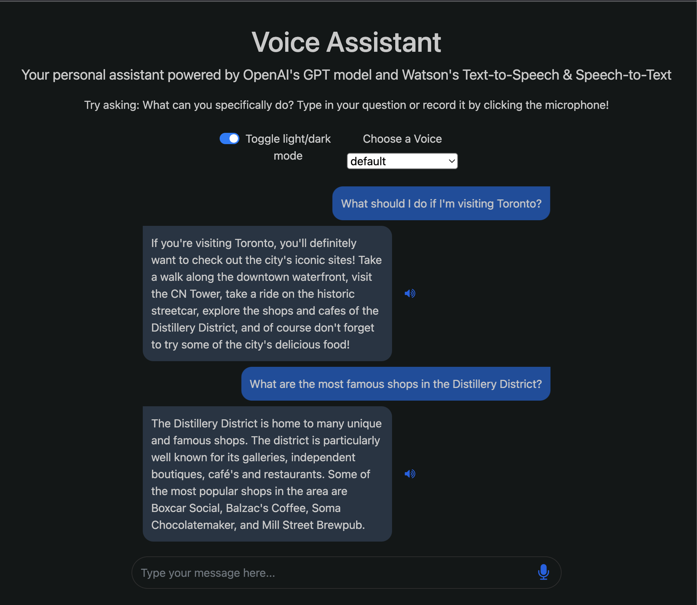

# VoiceGPT

This project is a voice assistant application that combines the power of OpenAI's GPT-3 language model and IBM Watson's speech-to-text and text-to-speech services. It allows users to interact with the assistant using voice commands and receive responses in both text and audio formats.

## Images of UI



## Features

- Speech-to-text conversion using IBM Watson's speech-to-text service
- Natural language processing and response generation using OpenAI's GPT-3 language model
- Text-to-speech conversion using IBM Watson's text-to-speech service
- Web-based user interface for interacting with the voice assistant

## Installation

1. Clone the repository:

```bash
git clone https://github.com/2611ansh/Voice-Assistant-with-OpenAI-s-GPT-3-and-IBM-Watson.git
```

2. Install the required dependencies:

```bash
pip install -r requirements.txt
```

3. Set up your OpenAI API key and IBM Watson credentials:

   - Open the `worker.py` file and replace `"..."` with your actual OpenAI API key.
   - Update the `base_url` variables in `worker.py` with your IBM Watson service URLs.

## Usage

1. Start the Flask server:

```bash
python server.py
```

2. Open your web browser and navigate to `http://localhost:8000`.

3. Click the microphone icon and start speaking your query or command.

4. The voice assistant will process your speech, generate a response using OpenAI's GPT-3, and provide the response in both text and audio formats.

## File Structure

- `requirements.txt`: List of Python dependencies required by the project.
- `server.py`: Flask server that handles the web interface and API routes.
- `worker.py`: Contains helper functions for speech-to-text, text-to-speech, and OpenAI API integration.
- `templates/index.html`: HTML template for the web interface.

## Contributing

Contributions are welcome! If you find any issues or have suggestions for improvements, please open an issue or submit a pull request.

## License

This project is licensed under the [MIT License](LICENSE).
